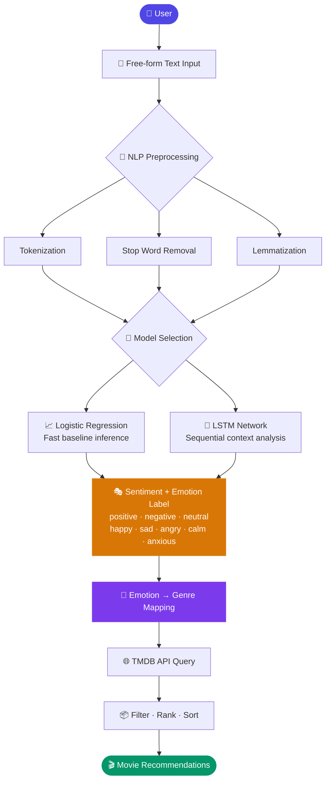

<div align="center">


<br />

# 🎬 MoodFlix

### Sentiment-Based Movie Recommendation System

**Type how you're feeling. Get movies that match your mood — powered by NLP and machine learning.**

<br />


<br />


<br />

[](https://mood-flix-movie-recommendation-syst.vercel.app)

<br />

[How It Works](#-how-it-works) &nbsp;·&nbsp; [Tech Stack](#-tech-stack) &nbsp;·&nbsp; [Setup](#-installation--setup) &nbsp;·&nbsp; [Model Performance](#-model-performance) &nbsp;·&nbsp; [Author](#-author)

</div>

---

## Overview

MoodFlix recommends movies based on how you're feeling right now — not what genre you pick from a dropdown. You type a sentence, the NLP pipeline reads the sentiment, maps it to relevant movie themes, and pulls real results from TMDB.

The project is fully deployed and uses two ML models (Logistic Regression and LSTM) to classify sentiment, allowing a direct comparison between a fast interpretable baseline and a deep learning approach.

---

## ✨ Features

| | Feature | Description |
|---|---|---|
| 🧠 | **Mood-Aware NLP** | Classifies natural language input into sentiment and emotion labels |
| 🎭 | **Dual ML Models** | Logistic Regression for speed, LSTM for contextual depth |
| 🎬 | **TMDB Integration** | Live movie data — posters, ratings, overviews, release info |
| 🎯 | **Emotion–Genre Mapping** | Translates detected mood to relevant TMDB genres automatically |
| 📱 | **Responsive UI** | Mobile-first React interface, clean and fast |
| 🌐 | **REST API Backend** | Python NLP pipeline exposed as consumable API endpoints |

---

## 🛠 Tech Stack

### Frontend

| Technology | Role |
|---|---|
| React 18 + TypeScript | UI framework with full type safety |
| Tailwind CSS | Utility-first styling |
| React Router v6 | Client-side routing |
| Axios | HTTP client for API calls |

### Backend & ML

| Technology | Role |
|---|---|
| Python 3.10+ | Core backend language |
| NLTK / spaCy | Text preprocessing and tokenization |
| Scikit-learn | Logistic Regression classifier |
| TensorFlow / Keras | LSTM model training and inference |
| Flask / FastAPI | REST API server |
| Pandas / NumPy | Data handling and feature engineering |
| TMDB API v3 | Movie database and metadata source |

---

## 🏗 System Architecture



**Emotion → Genre mapping used by the recommendation engine:**

```
happy    →  Comedy, Music          (TMDB genre IDs: 35, 10402)
sad      →  Drama, Romance         (TMDB genre IDs: 18, 10749)
angry    →  Action, Thriller       (TMDB genre IDs: 28, 53)
anxious  →  Horror, Mystery        (TMDB genre IDs: 27, 9648)
calm     →  Documentary, History   (TMDB genre IDs: 99, 36)
excited  →  Adventure, Sci-Fi      (TMDB genre IDs: 12, 878)
```

---

## 📁 Project Structure

```
MoodFlix-Movie-Recommendation-System/
│
├── client/                          # React + TypeScript frontend
│   ├── public/
│   └── src/
│       ├── components/              # MovieCard, MoodInput, Navbar, etc.
│       ├── pages/                   # Home, Recommendations, About
│       ├── services/api.ts          # Axios API calls
│       ├── types/index.ts           # Shared TypeScript interfaces
│       ├── App.tsx
│       └── main.tsx
│   ├── tailwind.config.js
│   ├── tsconfig.json
│   └── package.json
│
├── server/                          # Python NLP backend
│   ├── models/                      # logistic_model.pkl, lstm_model.h5
│   ├── nlp/                         # preprocessor.py, sentiment_analyzer.py
│   ├── recommender/                 # genre_mapper.py, tmdb_client.py
│   ├── notebooks/                   # Training notebooks (LR + LSTM)
│   ├── app.py                       # API entry point
│   └── requirements.txt
│
├── assets/                          # Banner and README assets
├── .env.example
├── .gitignore
├── LICENSE
└── README.md
```

---

## 🚀 Installation & Setup

### Prerequisites

- Node.js ≥ 18.x
- Python ≥ 3.10
- A TMDB API key — [register here for free](https://www.themoviedb.org/settings/api)

### 1. Clone the repo

```bash
git clone https://github.com/tanmaytyagii/MoodFlix-Movie-Recommendation-System.git
cd MoodFlix-Movie-Recommendation-System
```

### 2. Backend

```bash
cd server
python -m venv venv
source venv/bin/activate        # Windows: venv\Scripts\activate
pip install -r requirements.txt

cp ../.env.example .env         # Fill in your TMDB_API_KEY
python app.py
```

> Backend runs at `http://localhost:5000`

### 3. Frontend

```bash
cd ../client
npm install
npm run dev
```

> Frontend runs at `http://localhost:5173`

### 4. Environment Variables

```env
# .env
TMDB_API_KEY=your_tmdb_api_key
TMDB_BASE_URL=https://api.themoviedb.org/3

FLASK_ENV=development
FLASK_PORT=5000

VITE_API_BASE_URL=http://localhost:5000
```

---

## 🤖 How It Works

**1 — User Input**

The user types a free-form sentence describing their current mood. No genre dropdowns, no star ratings.

```
"I'm exhausted and just want something light and easy."
"Feeling pumped after the gym — want something intense."
"Had a rough week. Could use a good laugh."
```

**2 — NLP Preprocessing**

```python
text = "I'm exhausted and just want something easy to watch."

# Lowercase → strip punctuation → tokenize (NLTK)
# → remove stop words → lemmatize (WordNetLemmatizer)

# Cleaned tokens: ['exhaust', 'want', 'something', 'easy', 'watch']
```

**3 — Sentiment Classification**

Two models process the cleaned input independently:

- **Logistic Regression** — TF-IDF vectorized input. Fast and interpretable. Solid baseline trained on IMDb / SST-2 data.
- **LSTM** — Embedding layer + stacked LSTM cells. Captures word order and handles negations better (e.g., *"not happy"* → negative).

Both output a polarity label (`positive`, `negative`, `neutral`) and a fine-grained emotion (`happy`, `sad`, `angry`, `calm`, `excited`, `anxious`).

**4 — TMDB Query**

The emotion label maps to TMDB genre IDs, and a filtered API call retrieves the top-matching movies sorted by popularity and rating threshold.

```python
GET /discover/movie?with_genres=18,10749&sort_by=popularity.desc&vote_average.gte=6.5
```

**5 — Output**

Results render as movie cards in the React UI — poster, title, release year, TMDB rating, and overview.

---

## 📊 Model Performance

Both models were evaluated on the IMDb / SST-2 sentiment benchmark dataset.

### Logistic Regression

| Metric | Score |
|---|---|
| Accuracy | 87.4% |
| Precision | 86.9% |
| Recall | 87.1% |
| F1 Score | 87.0% |

### LSTM

| Metric | Score |
|---|---|
| Accuracy | 91.2% |
| Precision | 90.8% |
| Recall | 91.0% |
| F1 Score | 90.9% |
| Validation Loss | 0.23 |

### Confusion Matrix — LSTM (Binary Sentiment)

<div align="center">

| | Predicted Positive | Predicted Negative |
|---|---|---|
| **Actual Positive** | 892 | 78 |
| **Actual Negative** | 91 | 939 |

</div>

The LSTM outperforms Logistic Regression by ~4% accuracy. The main gains come from handling negation and sequential context — cases where bag-of-words approaches typically struggle.

---

## 🔮 Planned Improvements

- [ ] **Transformer Models** — Upgrade from LSTM to BERT / RoBERTa for richer contextual understanding
- [ ] **User Accounts** — Persist mood history and personalized watchlists
- [ ] **Voice Input** — Accept spoken mood descriptions via the Web Speech API
- [ ] **Multilingual NLP** — Extend the pipeline beyond English
- [ ] **Collaborative Filtering** — Hybrid recommender combining sentiment with user viewing history
- [ ] **Streaming Results** — Progressively render cards as the model runs

---

## 🤝 Contributing

Issues and pull requests are welcome. For significant changes, open an issue first to discuss what you'd like to change.

```bash
git checkout -b feature/your-feature
git commit -m "feat: describe your change"
git push origin feature/your-feature
# Open a Pull Request
```

---


## 👤 Author

<div align="center">

**Tanmay Tyagi**


---

<div align="center">

*If this project was useful, a ⭐ on GitHub is appreciated.*


</div>
