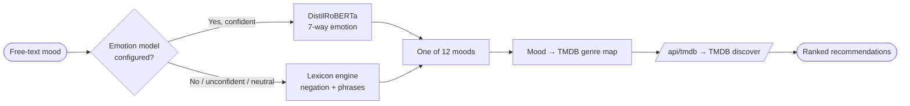
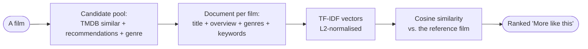

<div align="center">

# 🎬 MoodFlix

### Describe how you feel. Get films that match.

MoodFlix reads the mood behind a sentence and turns it into film recommendations —
no genre dropdowns, no star ratings, no account.

<br />

[](https://github.com/tanmaytyagii/MoodFlix-Movie-Recommendation-System/actions/workflows/ci.yml)
[](LICENSE)


[**Live demo →**](https://mood-flix-movie-recommendation-syst.vercel.app)

</div>

---

## Overview

Type *"had a rough week, could use a good laugh"* and MoodFlix works out that you want
a comedy. Type *"melancholy and wistful"* and it gives you quiet, aching drama instead
of lumping both under "sad".

Two independent recommendation paths sit behind that:

| | What it answers | How |
|---|---|---|
| **Mood-based discovery** | *"What should I watch given how I feel?"* | Emotion classification → curated mood-to-genre map → TMDB discovery |
| **Content-based similarity** | *"What else is like this film?"* | TF-IDF over overview, genres and keywords → cosine similarity ranking |

They are deliberately separate. Mood discovery compares *you* to a genre mapping;
"More like this" compares *films* to each other.

---

## Features

- **Twelve-mood taxonomy** — happy, sad, angry, excited, relaxed, romantic, adventurous,
  mysterious, fearful, nostalgic, thoughtful, melancholic
- **Free-text mood input** with negation handling — *"I'm not happy"* does not read as happy
- **Hosted emotion model** with an offline fallback, so the app works either way
- **Transparent classification** — the UI says whether a model or the keyword engine decided,
  and which words it matched
- **Content-based "More like this"** ranked by TF-IDF cosine similarity, with a % match
- **Shareable deep links** — `/movie/550` works on refresh, in a new tab, and from a shared link
- **Server-side TMDB proxy** — no API credential in the client bundle
- **Real error states** — an outage, an empty result and a rate limit are three different screens
- **Responsive and keyboard-accessible**, including a working mobile menu

---

## How it works

### Mood → films


```mermaid
flowchart LR
    A([Free-text mood]) --> B{Emotion model<br/>configured?}
    B -->|Yes, confident| C[DistilRoBERTa<br/>7-way emotion]
    B -->|No / unconfident / neutral| D[Lexicon engine<br/>negation + phrases]
    C --> E[One of 12 moods]
    D --> E
    E --> F[Mood → TMDB genre map]
    F --> G[/api/tmdb → TMDB discover/]
    G --> H([Ranked recommendations])
```

The lexicon engine is not a fallback of last resort — it covers moods the model has no
label for at all (`nostalgic`, `mysterious`, `thoughtful`, `melancholic`), so a confident
`neutral` from the model defers to it.

### Film → similar films


```mermaid
flowchart LR
    A([A film]) --> B[Candidate pool:<br/>TMDB similar + recommendations + genre]
    B --> C[Document per film:<br/>title + overview + genres + keywords]
    C --> D[TF-IDF vectors<br/>L2-normalised]
    D --> E[Cosine similarity<br/>vs. the reference film]
    E --> F([Ranked 'More like this'])
```

### Mood → genre mapping

Editorial curation, not learned weights:

```
happy        →  Comedy, Family, Animation, Music
sad          →  Drama, Romance
angry        →  Action, Crime, Thriller
excited      →  Action, Adventure, Science Fiction
relaxed      →  Documentary, Animation, Family
romantic     →  Romance, Drama, Comedy
adventurous  →  Adventure, Fantasy, Western
mysterious   →  Mystery, Thriller, Crime
fearful      →  Horror, Thriller, Mystery
nostalgic    →  Family, Music, History
thoughtful   →  Drama, Documentary, History
melancholic  →  Drama, Romance, Music
neutral      →  (no mapping — shows trending instead of guessing)
```

---

## Screenshots

<!--
  No screenshots are committed yet — placeholders are intentional rather than
  fabricated. Capture the four views below, save them to docs/screenshots/, and
  uncomment the matching line. See docs/screenshots/README.md.
-->

| View | |
|---|---|
| **Home** — mood input | <!--  --> _screenshot pending_ |
| **Recommendations** — results with detected-mood panel | <!--  --> _screenshot pending_ |
| **Movie details** — metadata and "More like this" | <!--  --> _screenshot pending_ |
| **Mobile** — navigation menu | <!--  --> _screenshot pending_ |

---

## Machine learning — what is and isn't here

Being precise about this, because it is easy to overstate.

**What ships:**

- A **pretrained** emotion classifier, [`j-hartmann/emotion-english-distilroberta-base`](https://huggingface.co/j-hartmann/emotion-english-distilroberta-base),
  consumed through the Hugging Face Inference API. DistilRoBERTa fine-tuned for 7-way
  emotion classification. MoodFlix maps its labels onto its own mood taxonomy.
- A **rule-based lexicon engine** — a curated vocabulary with negation scoping, phrase
  matching, intensifiers and deterministic tie-breaking. Transparent and instant, but a
  heuristic, and labelled as one in the UI.

**What does not ship:** no model trained by this project, and therefore **no accuracy,
precision, recall, F1 or confusion matrix is claimed anywhere in this repository.**

Publishing metrics would require a labelled emotion dataset and a proper train/validation/test
split. The dataset in `notebooks/data/` is IMDb *metadata* — summaries, writers, directors,
genres — with no sentiment or emotion labels to train against. Training a MoodFlix-specific
classifier is on the roadmap below; until it exists and has been evaluated, there are no
numbers to report.

### Confidence, honestly

The two engines report different quantities, so the UI labels them differently:

| Source | Shown as | What it means |
|---|---|---|
| Emotion model | `Emotion model · 87% confidence` | The model's softmax probability |
| Lexicon | `Keyword match · 67% mood match · matched "rough week"` | Dominant mood's share of matched weight, damped by evidence volume |
| Manual pick | `You chose this mood.` | No inference involved |

Below a confidence threshold, MoodFlix says the mood was unclear instead of guessing quietly.

### `notebooks/`

`ProjectRecommendation.ipynb` is the exploratory TF-IDF pipeline over IMDb metadata that
informed the similarity approach. It is **data preparation research** — it trains no model.
See [`notebooks/README.md`](notebooks/README.md). Nothing in `src/` imports from it; the
technique was reimplemented in TypeScript so the browser never downloads the 2.6 MB dataset.

---

## Recommendation system

`src/lib/tfidf.ts` is a dependency-free TF-IDF implementation:

- **Tokenisation** — lowercase, strip non-letters, drop stop words plus film-blurb filler
  (`movie`, `story`, `young`, `man` — words in a large share of TMDB overviews), conservative stemming
- **TF** — term count ÷ document length
- **IDF** — smoothed, `ln((1 + N) / (1 + df)) + 1`, so a term in every document still gets positive weight
- **Vectors** — L2-normalised, so cosine similarity is a dot product
- **Ranking** — descending similarity, ties broken by TMDB id so results never drift between runs

Genres are weighted double in each document, so sharing a genre counts for more than sharing
an incidental synopsis word. Candidates below a similarity floor are dropped rather than padded in.

---

## Security

**The TMDB credential is never sent to the browser.** All TMDB traffic goes through a
serverless proxy:

```
Browser  →  /api/tmdb?path=/discover/movie  →  TMDB
            (holds TMDB_TOKEN server-side)
```

- The token lives in `process.env.TMDB_TOKEN` and is read only inside `api/`. It is
  deliberately **not** `VITE_`-prefixed — Vite inlines any `VITE_*` variable into the
  client bundle, which would put the secret straight back into shipped JavaScript.
- `path` is validated against an **allowlist** of anchored patterns, so it cannot be used
  to point the authenticated proxy at another host, at TMDB write endpoints, or through
  path traversal. Query parameters are allowlisted too.
- Upstream errors are translated, never passed through — TMDB error bodies and outbound
  request details (including the `Authorization` header) never reach the client.
- Mood text is sent by **POST**, so it does not land in server access logs or CDN cache keys.

There are 30 tests in `api/_tmdb.test.ts` covering exactly these properties.

### ⚠️ Historical credential exposure

An earlier commit hardcoded a TMDB API key and read token in `src/utils/constants.ts`.
Removing them from the working tree **does not remove them from Git history** — anyone
with a clone can still read them.

**That credential must be treated as compromised and revoked at
[TMDB → Settings → API](https://www.themoviedb.org/settings/api).** Rotating the token
is the fix; rewriting history is optional cleanup and, on a public repo that may already
have been cloned or forked, is not a substitute for revocation.

---

## Tech stack

| Layer | Technology |
|---|---|
| UI | React 18, TypeScript 5, Tailwind CSS 3, Framer Motion, Lucide icons |
| Routing | React Router 6 |
| Build | Vite 5 |
| Backend | Vercel serverless functions (`api/`), Node 20 |
| Data | TMDB API v3 |
| ML | Hugging Face Inference API — DistilRoBERTa emotion classifier |
| Testing | Vitest, React Testing Library, jsdom |
| CI | GitHub Actions |

---

## Project structure

```
MoodFlix-Movie-Recommendation-System/
├── api/                        # Vercel serverless functions
│   ├── _shared.ts              #   transport adapter shared by both handlers
│   ├── _tmdb.test.ts           #   underscore = not deployed as a route
│   ├── tmdb.ts                 #   TMDB proxy — holds the credential, allowlists paths
│   └── emotion.ts              #   Hugging Face emotion-model proxy
├── src/
│   ├── components/             # MovieCard, MoviePoster, Header, SimilarMovies, …
│   ├── context/                # AppProvider + useAppContext hook
│   ├── lib/tfidf.ts            # TF-IDF + cosine similarity
│   ├── pages/                  # Home, Recommendations, MovieDetails, About, NotFound
│   ├── services/
│   │   ├── apiClient.ts        #   shared HTTP client + ApiError taxonomy
│   │   ├── moodLexicon.ts      #   curated mood vocabulary
│   │   ├── sentimentService.ts #   lexicon engine (negation, phrases, confidence)
│   │   ├── moodService.ts      #   model-first classifier with lexicon fallback
│   │   ├── tmdbService.ts      #   TMDB access through the proxy
│   │   └── recommendationService.ts  # content-based "More like this"
│   ├── types/                  # shared interfaces
│   └── utils/constants.ts      # genre maps, mood tables
├── notebooks/                  # exploratory TF-IDF research (not imported by the app)
├── docs/screenshots/           # drop real screenshots here
├── .github/workflows/ci.yml
├── .env.example
├── .vercelignore               # keeps tests and notebooks out of the deployment
└── vercel.json                 # SPA rewrites, excluding /api
```

---

## Local development

**Prerequisites:** Node.js ≥ 18, and a free [TMDB v4 Read Access Token](https://www.themoviedb.org/settings/api).

```bash
git clone https://github.com/tanmaytyagii/MoodFlix-Movie-Recommendation-System.git
cd MoodFlix-Movie-Recommendation-System

npm install
cp .env.example .env     # then add your TMDB_TOKEN
npm run dev
```

The app runs at **http://localhost:5173**. The Vite dev server mounts the same `api/`
handlers Vercel uses in production, so `/api/tmdb` works locally with no extra process.

### Environment

| Variable | Required | Purpose |
|---|---|---|
| `TMDB_TOKEN` | **Yes** | TMDB v4 Read Access Token (not the v3 API key) |
| `HUGGINGFACE_API_TOKEN` | No | Enables the hosted emotion model. Without it, the lexicon engine handles everything |
| `HUGGINGFACE_EMOTION_MODEL` | No | Override the default emotion model |

None are `VITE_`-prefixed, by design — see [Security](#security).

### Scripts

| Command | What it does |
|---|---|
| `npm run dev` | Dev server with the API routes mounted |
| `npm run build` | `tsc -b && vite build` — a type error fails the build |
| `npm run typecheck` | TypeScript across `src/` and `api/` |
| `npm run lint` | ESLint |
| `npm test` | Vitest, single run |
| `npm run test:watch` | Vitest in watch mode |
| `npm run preview` | Serve the production build |

---

## Testing

```bash
npm test
```

174 tests across 10 files, covering the logic worth protecting:

| Suite | Covers |
|---|---|
| `sentimentService.test.ts` | Negation, vocabulary, confidence bounds, determinism, phrase handling |
| `moodLexicon.test.ts` | Vocabulary invariants — no term may belong to two moods |
| `moodService.test.ts` | Model-preferred classification and every fallback path |
| `tfidf.test.ts` | Tokenisation, IDF weighting, unit vectors, cosine symmetry and bounds |
| `recommendationService.test.ts` | Self-exclusion, deduplication, ranking, missing metadata, partial upstream failure |
| `tmdbService.test.ts` | Success, empty results, and network / timeout / 404 / 429 / 5xx failures |
| `api/_tmdb.test.ts` | Path allowlist, SSRF and traversal rejection, parameter filtering, credential never leaked |
| `MoviePoster.test.tsx` | Fallback rendering, load-failure recovery, layout stability |
| `Header.test.tsx` | Mobile menu open/close, Escape, focus return, ARIA wiring |

---

## Continuous integration

[`.github/workflows/ci.yml`](.github/workflows/ci.yml) runs on every push to `main` and
every pull request:

```
npm ci  →  npm run lint  →  npm run typecheck  →  npm test  →  npm run build
```

The badge at the top reflects the real result of that workflow.

---

## Deployment

Deploys to Vercel as a Vite SPA plus serverless functions.

1. **Set `TMDB_TOKEN`** in the Vercel project's environment variables. Without it
   `/api/tmdb` returns 503 and no movies load. Optionally set `HUGGINGFACE_API_TOKEN`
   to enable the hosted emotion model.
2. Deploy. `vercel.json` rewrites every non-`/api` route to `index.html`; Vercel does
   **not** do this automatically for Vite, so without it deep links 404.
3. Verify after deploying:

   | Check | Expected |
   |---|---|
   | `/` | App loads |
   | `/recommendations`, `/about` | Load on direct navigation, not 404 |
   | `/movie/550` | Fight Club, including "More like this" |
   | `/movie/550` after a refresh | Still loads |
   | `/not-a-real-route` | In-app 404 page |
   | `/api/tmdb?path=/account` | `{"error":{"code":"path_not_allowed"}}` |

Test files are underscore-prefixed inside `api/` and excluded by `.vercelignore`, so
they are never deployed as functions.

---

## Roadmap

- **Train a MoodFlix-specific emotion classifier** on a labelled dataset (GoEmotions or
  similar), publish real evaluation metrics, and replace the hosted general-purpose model
- **Hybrid ranking** — blend content similarity with mood fit rather than keeping them separate
- **Watchlists** — persistence, which currently does not exist anywhere in the app
- **Voice input** via the Web Speech API
- **Multilingual moods** — both engines are English-only today

---

## Contributing

Issues and pull requests are welcome. CI must pass, which means lint, typecheck, tests and
build all green.

```bash
git checkout -b feature/your-feature
npm run lint && npm run typecheck && npm test
git commit -m "feat: describe your change"
```

---

## Acknowledgements

- Movie data from [The Movie Database (TMDB)](https://www.themoviedb.org/). This product uses
  the TMDB API but is not endorsed or certified by TMDB.
- Emotion model by [j-hartmann](https://huggingface.co/j-hartmann/emotion-english-distilroberta-base).

## License

[MIT](LICENSE) © Tanmay Tyagi
